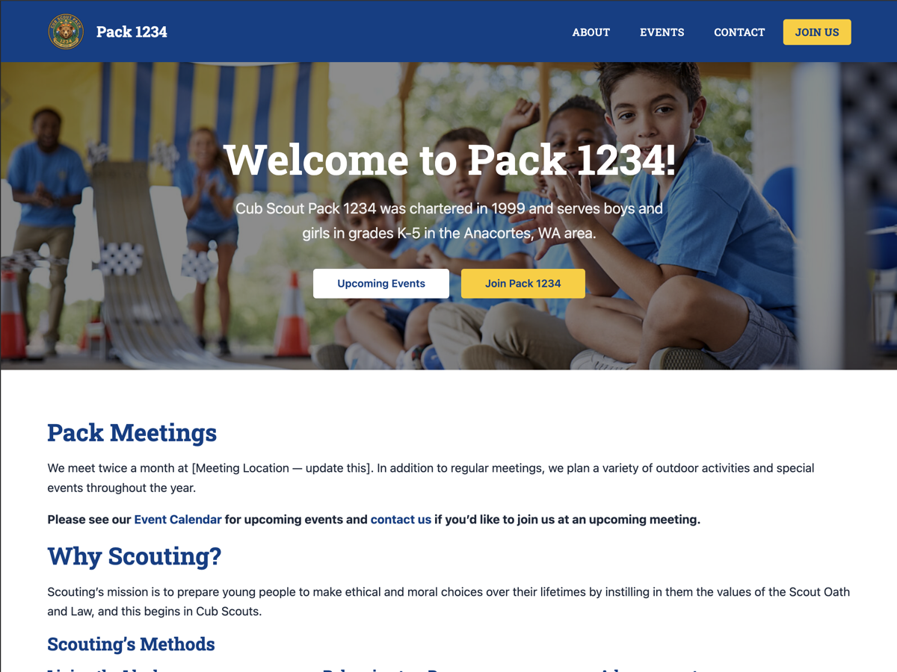

# Scout Starter

A minimal WordPress starter theme for Scouting units — Cub Scouts, Scouts BSA Troops, and more.

Upon activation the theme creates core pages for you (homepage, about, events, join, contact) and wires up a primary nav menu. Built for distribution to unit leaders who need a clean, functional site with zero configuration complexity.

## Features

- **Auto-setup on activation** — default pages, static front page, and primary nav menu created automatically
- **Per-page hero section** — full-width hero with featured image background (or color fallback) and optional subtitle
- **Custom color pickers** — set primary, accent, nav, hero, and footer colors via Customizer
- **Scouting America-aligned defaults** — navy `#003F87` + gold `#FFCC00`
- **Latest News section** — optional recent posts grid on the homepage (off by default)
- **Starter content** — dual Pack/Troop content on each page; delete the section that doesn't apply
- **Responsive** — mobile navigation toggle, fluid layout
- **No dependencies** — vanilla CSS and PHP, no build step, no frameworks
- **3 footer widget areas**

## Setup

1. Upload theme folder to `/wp-content/themes/` and activate
2. Default pages and a Primary Menu are created automatically
3. Go to **Appearance > Customize > Scout Colors** to set your unit's colors
4. Edit each page — remove the setup note at the top and delete the Pack or Troop section that doesn't apply
5. Upload your logo via **Appearance > Customize > Site Identity**
6. Add widgets to Footer 1, 2, and 3 areas (contact info, meeting times, quick links)

## Hero Section

Enable a full-width hero on any page via the **Hero Section** panel in the page editor sidebar. Set a **Featured Image** on the page to use it as the background, or it will fall back to your configured hero color. Add a **Page Excerpt** to show it as a subtitle beneath the page title.

The home page has the hero enabled automatically.

## Customizer Settings

**Scout Colors** — primary, accent, navigation background, hero background, footer background

**Latest News** — enable/disable a recent posts grid on the homepage, with optional custom heading and date display

## Deployment

Includes two GitHub Actions workflows:

- **Deploy on push** — rsync to your server via SSH on every push to `main`
- **Release zip** — builds a versioned theme zip and creates a GitHub Release when `Version:` in `style.css` is bumped

## License

GPL v2 or later.
